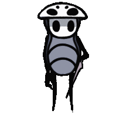
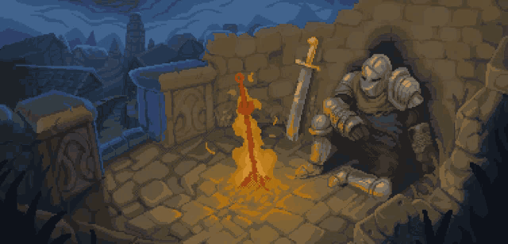

 
 

<h1 align="center">Hi  I'm Abderrahmane Fatimi</h1>

<h3 align="center">passionate full-stack  developer</h3>

  

- 🔭 I’m currently working on a **Social media website**

- 🌱 I’m currently learning **Typescript** and **Laravel**

- 📫 How to reach me **abderrahmanefatimi742@gmail.com**

- ⚡ Fun fact **My IQ score stands at 137**

<h3>Connect with me:</h3>

<h3>Languages and Tools:</h3>
 

  
  

